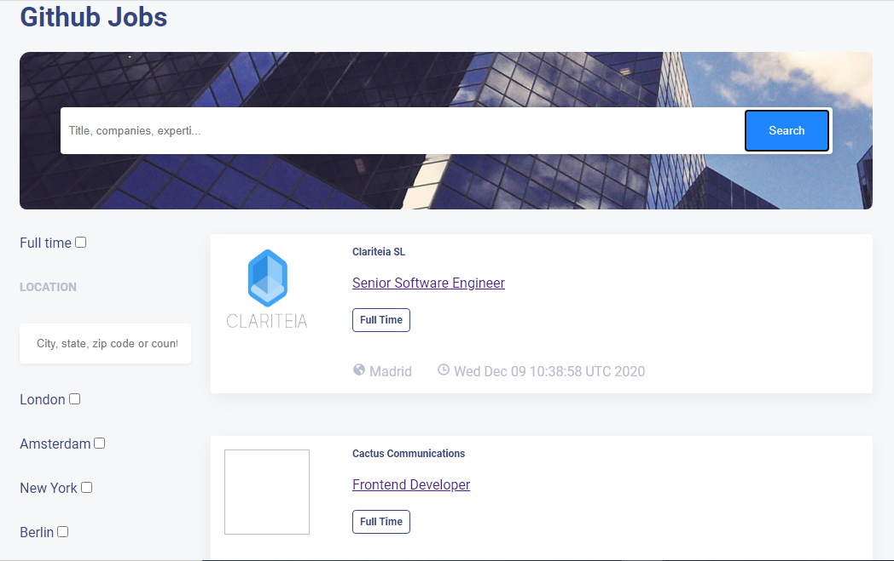

# Github Jobs

## Overview



### My experience :
I didn't really have experience in this project. I could not get most of the main thing that is meant to do and to have.

### Project stucture : 

- I have*Context* file which contains *UseReducer* for handling the state.
- Inside the useReducer, I have *a function* and *initial value*. 
- I have 4 components files which are: 
- *Header* : contains the search title,    companies, expertise or benefits input with the research button
- *JobDetails* : contains the job details
- *listOfJobs* : shows all the lists of job
- And *location* : contains a big form to filter the locations, city, state, zip code or country.

### If you had more time,

- I still want to work with **filtering**, **pagination** and **useParams**

### Area of the project that I would like improving

- css,
- filtering items
- pagination,
- showing the the details in another page.

### The most challenging part of the project:

- filtering the array from the **API** indeed filtering the checkbok.
- Showing the details page. I got empty page when I click the link.


### Built With

<!-- This section should list any major frameworks that you built your project using. Here are a few examples.-->

-   [React](https://reactjs.org/)

## How To Use

<!-- Example: -->

To clone and run this application, you'll need [Git](https://git-scm.com) and [Node.js](https://nodejs.org/en/download/) (which comes with [npm](http://npmjs.com)) installed on your computer. From your command line:

```bash
# Clone this repository
$ git clone https://github.com/your-user-name/your-project-name

# Install dependencies
$ npm install

# Run the app
$ npm start
```

## Contact

-   Website [your-website.com](https://github-jobs-natacha.netlify.app/)
-   GitHub [@your-username](https://github.com/tsipoy/github-jobs)
